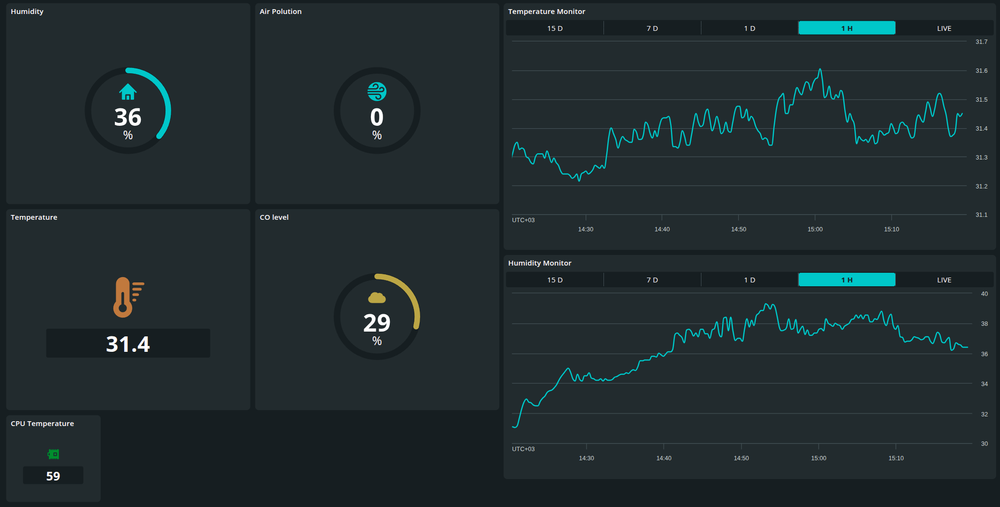

# Arduino Cloud C++ API

> ❗️The library is still in early-stage implementation❗️

This C++ library provides interaction with the Arduino Cloud MQTT broker. It serves as a `C++` alternative to the officially provided [Javascript](https://docs.arduino.cc/arduino-cloud/api/javascript/), [Python](https://docs.arduino.cc/arduino-cloud/api/python/), and [Golang](https://github.com/arduino/iot-client-go) clients.

Was originally designed for **Linux-based devices** to interact with the Arduino Cloud and can be accessed through a set of endpoints to manage `Devices`, `Things`, `Properties` and more.

## Dashboard Example

To see full example, navigate to the [examples/rpi-iot-gateway](examples/rpi-iot-gateway/README.md).



## Background

This library started as a personal experiment and practical need: I wanted a `C++` native way to interact with the `Arduino Cloud` without relying on the official Python, JavaScript, or Go SDKs.

Since the target use case was Linux-based systems and embedded gateways, C++ felt like a natural fit — offering full control over performance, memory, and system-level integration. The decision was also partly preference-driven: C++ is the primary language used in this project, and it better matches the rest of the embedded and systems-oriented stack.

The [Original Arduino C++ client library](https://github.com/arduino-libraries/ArduinoIoTCloud/tree/master), however, is not really designed with `Raspberry Pi` or other general-purpose SBCs in mind, and in practice it is not well supported or easily portable to such environments. 

This motivated the idea of building a more generic and portable C++ implementation that could run on essentially any single-board computer.

⚡️ In future iterations, the same API design is planned to be ported to `Rust`, providing a safer and more modern alternative while preserving the same architecture and communication model.

## Arduino Cloud Notes

Connection via this library is achieved by registering a **manual device**, i.e. a virtual device that is not associated with an Arduino hardware board. This virtual device can connect through a simple username/password (Device ID, Secret Key) which is generated in the Arduino Cloud when configuring a device.

- MQTT topics are generated from `Things` as `/a/t/<thing_id>/e/o`.
- The client connects to `ssl://iot.arduino.cc:8884` with the manual device ID (from ) as the MQTT username and the secret key as the password.
- Property updates are packed as SenML-style CBOR arrays: property name uses key `0`, numeric values use key `2`, string values use key `3`, and boolean values use key `4`.
- Publishes use QoS `1` with retained messages disabled; `sync()` respects the configured publish period while `publish()` sends the provided updates immediately.

> The information was gathered while reviewing the source code of the Python and JavaScript implementations.

## Getting Started

To start working with library you will only need to get Arduino Cloud credentials and install needed dependencies.

### Get Arduino Cloud Credentials

The library awaits file [credentials_example.json](credentials_example.json) with the following structure:

```
{
  "device_id": "12345678-1234-1234-1234-1234567890123",
  "secret_key": "ABCEF1234567890!@#$%^&*()",
  "thing_id": "12345678-1234-1234-1234-1234567890123"
}
```

The `Device` itself it **manually configured device**, like used for `Javascript`, `Python`, and `Golang` options. Other credentials obtained when registering and creating `Thing(s)`.

### Dependencies

The CMake target currently expects these dependencies to be available:

- CMake 3.16+
- C++17 compiler
- OpenSSL
- Threads
- libcbor
- Eclipse Paho MQTT C++

## Project Layout

The application code should use this library through `ArduinoCloud` class. MQTT,
Paho, TLS setup, topics, publish counters, and CBOR/SenML packing stay inside
the library.

```text
src/client/
  ArduinoCloud.hpp/.cpp    Public library entry point

src/mqtt/
  MqttClient.hpp/.cpp      Paho MQTT adapter and connection handling

src/cborp/
  CborPacker.hpp/.cpp      SenML CBOR payload packing

src/types/
  Thing.hpp                Arduino IoT Cloud Thing topic helper
  PropertyUpdate.hpp       Property update API types
```

## Project Example

To see library in action, navigate to the [examples/rpi-iot-gateway](examples/rpi-iot-gateway/README.md)

## Build Library

### ⚡️ Native build (host)

TODO

### ⚡️ Cross-compile for Raspberry Pi

When cross-compiling for a Raspberry Pi target, make sure that `libcbor` and Paho are installed in the configured `SYSROOT`. This project's CMake configuration searches for `cbor.h` and the `libcbor` library under `$SYSROOT/usr`.

### Prepare SYSROOT

The first step is to connect to the device and install the required development packages:

```sh
$ ssh pi@192.168.0.105

# On the Raspberry Pi:
sudo apt update
sudo apt install -y libcbor-dev libssl-dev build-essential libpaho-mqtt-dev pkg-config cmake git rsync
exit # exit from Raspberry Pi
```

After the installation is complete, create on **your host machine** a local SYSROOT directory, e.g. `$HOME/rpi-sysroot`:

```sh
mkdir -p "$HOME/rpi-sysroot"
```

Then sync the required Raspberry Pi system headers and libraries into it:

```sh
export RPI_HOST=192.168.0.105

rsync -a --delete "$RPI_HOST:/lib" "$HOME/rpi-sysroot/"
rsync -a --delete "$RPI_HOST:/usr/include" "$HOME/rpi-sysroot/usr/"
rsync -a --delete "$RPI_HOST:/usr/lib" "$HOME/rpi-sysroot/usr/"
```

Now SYSROOT is synchronized and you can proceed with the cross-compilation process.

### Prepare Docker build environment

To ensure a consistent and reproducible build environment across different host systems, we can use **Docker** for cross-compilation. This avoids dependency issues caused by varying Linux distributions and package versions on developer machines.

Since Raspberry Pi OS is `Debian-based`, using a Debian-based Docker image also helps keep the build environment aligned with the target system.

The examples below use a `debian:trixie` Docker container to provide a clean and consistent Debian-based build environment that closely matches the Raspberry Pi OS target.

The container mounts `$HOME` as `/rpi-env`, making the sysroot located at e.g. `$HOME/rpi-sysroot` available inside Docker as `/rpi-env/rpi-sysroot`.

Run the container:

```sh
docker run --rm -it \
  -v $HOME:/rpi-env \
  -w /rpi-env \
  debian:trixie bash
```

In Docker:

```sh
apt update

apt install -y cmake ninja-build pkg-config git \
  gcc-arm-linux-gnueabihf g++-arm-linux-gnueabihf \
  ca-certificates
```

And set your `SYSROOT` directory as:

```sh
export SYSROOT=/rpi-env/rpi-sysroot
```

### Install Paho libraries from sources (optional)

In case if some MQTT Paho dependencies is not satisfied, you will need to build Paho libs for Raspberry Pi.

To do so, use the same [toolchain-rpi.cmake](toolchain-rpi.cmake) as the parent project, like:

```cmake
set(CMAKE_SYSTEM_NAME Linux)
set(CMAKE_SYSTEM_PROCESSOR arm)

# IMPORTANT: use host-installed cross compiler, NOT sysroot/bin
set(CMAKE_C_COMPILER   /usr/bin/arm-linux-gnueabihf-gcc)
set(CMAKE_CXX_COMPILER /usr/bin/arm-linux-gnueabihf-g++)

set(CMAKE_SYSROOT //rpi-env/rpi-sysroot)
set(CMAKE_FIND_ROOT_PATH //rpi-env/rpi-sysroot)

# Search headers/libs in sysroot
set(CMAKE_FIND_ROOT_PATH_MODE_PROGRAM NEVER)
set(CMAKE_FIND_ROOT_PATH_MODE_LIBRARY ONLY)
set(CMAKE_FIND_ROOT_PATH_MODE_INCLUDE ONLY)
set(CMAKE_FIND_ROOT_PATH_MODE_PACKAGE ONLY)

# Optional: help find /usr/local in sysroot
list(APPEND CMAKE_PREFIX_PATH
  //rpi-env/rpi-sysroot/usr/local
  //rpi-env/rpi-sysroot/usr
)
```

To install `paho.mqtt.c` clone and install from sources call in Docker env:

```sh
git clone https://github.com/eclipse/paho.mqtt.c.git
cd paho.mqtt.c
cmake -S . -B build \
  -DCMAKE_TOOLCHAIN_FILE=<path/to/toolchain-rpi.cmake> \
  -DCMAKE_INSTALL_PREFIX=/usr \
  -DPAHO_WITH_SSL=TRUE \
  -DPAHO_BUILD_SHARED=TRUE
cmake --build build -j
DESTDIR="$SYSROOT" cmake --install build
cd ..
```

To install `paho.mqtt.cpp` clone and install from sources call in Docker env:

```sh
git clone https://github.com/eclipse/paho.mqtt.cpp.git
cd paho.mqtt.cpp
cmake -S . -B build \
  -DCMAKE_TOOLCHAIN_FILE=<path/to/toolchain-rpi.cmake> \
  -DCMAKE_INSTALL_PREFIX=/usr \
  -DCMAKE_PREFIX_PATH="$SYSROOT/usr"
cmake --build build -j
DESTDIR="$SYSROOT" cmake --install build
```

And sync SYSROOT with new libs with RPi:

```
rsync -avz "$HOME/rpi-sysroot/usr/" pi@192.168.0.105:/usr/
```

After these steps, the library can be consumed from CMake.

## Basic Usage

Create an `ArduinoCloud` instance, configure the target `Thing` with `Variables` (Floating Point Number) like **cpu_temperature** and **home_humidity** with mock values as demo. Publish it with interval (60 seconds here), and provide a callback returning mentioned property updates that will be synchronized with Arduino IoT Cloud:

```cpp
#include "ArduinoCloud.hpp"

ArduinoCloud cloud(device_id, device_secret);

cloud.addThing(thing_id);
cloud.setPeriod(60);
cloud.start();

cloud.sync([] {
    return PropertyUpdates
    {
        {"cpu_temperature", 52.4},
        {"home_humidity", 38.0},
    };
});

// cloud.stop();
```

The `sync()` method checks the configured period before collecting and publishing
properties. It is meant to be called regularly from the application loop.

The `publish()` can be used when the caller already has a list of property updates
and wants to send it immediately:

```cpp
cloud.publish({
    {"home_temperature", 23.5},
    {"status", std::string{"ready"}},
});
```

## Property Values

Use `PropertyUpdate` / `PropertyUpdates` to describe data sent to Arduino IoT
Cloud:

```cpp
using PropertyUpdates = std::vector<PropertyUpdate>;
```

Supported input values:

- `double`
- `float` packed as `double`
- `int` packed as `uint32_t` when non-negative, otherwise as `double`
- `uint32_t`
- `bool`
- `std::string`
- `const char *`

## Public API

```cpp
class ArduinoCloud
{
public:
    ArduinoCloud(const std::string &device_id,
                 const std::string &device_secret);
    ~ArduinoCloud();

    using PropertyReader = std::function<PropertyUpdates()>;

    void start();
    void stop();
    void addThing(const std::string &thing_id);
    void setPeriod(int seconds);
    void sync(const PropertyReader &reader);
    void publish(const PropertyUpdates &updates);
};
```

## CMake Usage notes

From the parent project you can add library as:

```cmake
add_subdirectory(libs/ArduinoIOTCloud)

target_link_libraries(my_app PRIVATE
  ArduinoIOTCloud::ArduinoIOTCloud
)
```

The library exposes public include paths for:

- `src/client`
- `src/types`

The MQTT, CBOR, and logger internals are private include paths.
